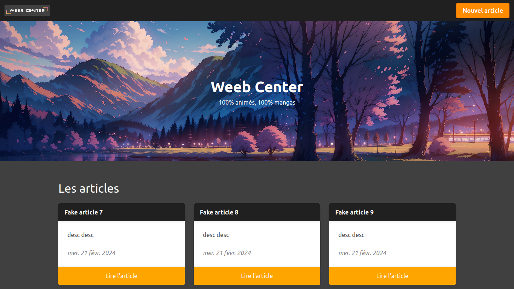

# La Capsule, projet n°2 : Custom Hook

Ce projet [Next.js](https://nextjs.org/) est basé sur le template de la commande [`create-next-app`](https://github.com/vercel/next.js/tree/canary/packages/create-next-app).

Il utilise [next/font](https://nextjs.org/docs/basic-features/font-optimization) pour automatiquement optimiser et charger la police **Inter**, une police de Google Font.

Objectif: Créer un mini blog dont les articles sont écrits en Markdown, avec une prévisualisation du rendu de l'article.

## Auteur(s)

- [@Mar-Nb](https://www.github.com/Mar-Nb)

## Capture d'écran

## Technologies utilisées

**Client:** Next.js 13, Typescript, Bulma, Font Awesome

**Base de données**: SQLite

**Outils externes**: Cloudinary

**Bibliothèques**: React Markdown, Remark Gemoji, Remark Breaks, Remark Gfm, Remark Math

## Fonctionnalités

- Création d'articles en Markdown
- Prise en charge de fonctionnalités Markdown étendues (*Github Flavoured Markdown*, émoji, saut de ligne, notation mathématique)
- Prévisualisation du rendu de l'article
- Liste d'article paginée

## Démo

Le projet est déployé sur Vercel à l'adresse suivante : <https://mini-blog-nextjs-lacapsule.vercel.app/>

